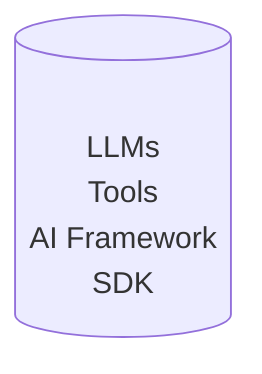

## 动机与目标
NVIDIA、AMD、昇腾等不同算力供应方分别推出各自的SDK以及各种AI加速库，但是多样性的算力和软件环境差异给用户部署AI应用带来了诸多不便。为了改善这一问题，不同厂商分别发布了对应各自算力的AI容器镜像，用户只需要在目标环境中加载镜像并启动容器，这大大减少了应用部署和环境配置的时间，使得AI模型的使用过程更加高效。

在此背景之下，制作和发布基于openEuler的AI容器镜像变得越来越迫切。但是目前对开发者制作相应AI容器镜像的指导非常匮乏，不同场景的容器镜像应该预装哪些软件？镜像Tag如何规范？

### 现状
目前主流厂商发布AI容器镜像的预装软件内容及Tag示例如下表所示
|           | NVIDIA     | AMD     |
|-----------|------------|---------|
| Softwares | `base`: CUDA runtime (cudart)  `runtime`: `base` + CUDA math libraries + NCCL + cuDNN  `devel`: `runtime` + tools for building CUDA images | ROCm + pytorch   ROCm + tensorflow |
| Tags      | `<cuda-version>-base/runtime/devel-<os><os-vsesion>`  for example, `12.2.0-runtime-ubuntu20.04` | - `rocm<rocm-version>_<os><os-version>_py<py-version>_pytorch_<pytorch-version>`      - `rocm<rocm-version>-<os><os-version>-tf<tf-version>-dev`   for example, `rocm5.7_ubuntu22.04_py3.10_pytorch_2.0.1`  |

1. 软件栈

- NVIDIA提供的`base`镜像（见[https://hub.docker.com/r/nvidia/cuda](https://hub.docker.com/r/nvidia/cuda)）中封装的CUDA和cuDNN来自于[gitlab.com/nvidia/cuda](https://gitlab.com/nvidia/container-images/cuda) ，`runtime`镜像中的nvidia-container-runtime来自于 https://github.com/NVIDIA/nvidia-container-runtime。
- AMD的镜像（见https://hub.docker.com/r/rocm/pytorch、https://hub.docker.com/r/rocm/tensorflow）中预装了ROCm(https://github.com/RadeonOpenCompute/ROCm)、pytorch或tensorflow、以及配套的python版本。

尽管不同厂商镜像中预装的软件内容存在差异，但软件栈分层基本相似，加上大模型应用，则AI容器镜像可归纳为以下几层

- LLMs: 大模型应用
- Tools: 模型配套工具
- AI Framework: AI框架，如pytorch, tensorflow等
- SDK: 提供不同算力的SDK

2. 镜像TAG

综合来看，NVIDIA和AMD的AI容器镜像tag一般由镜像中预装软件和版本信息组合而成，通常为：`<sdk><sdk-version>-<os><os-version>-<framework><framework-version>`

### 本oEEP的目的
指导不同算力设备的开发者，如何制作基于openEuler的AI容器镜像。

## 方案描述

### 镜像内容及Tag规则
- 基础SDK镜像：包含不同算力SDK的基础镜像，Tag为`<sdk><sdk-version>-oe<openeuler-version>`，例如，cann7.0.RC1.alpha002-oe2203sp2
- AI框架镜像：在基础SDK镜像之上，包含AI框架的镜像，Tag为`<framework><framework-version>-<sdk><sdk-version>-oe<oe-version>`，例如，pytorch2.1.0-cann7.0.RC1.alpha002-oe2203sp2
- 大模型应用镜像：在AI框架镜像之上，包含AI应用的镜像`<LLMs>-<framework><framework-version>-<sdk><sdk-version>-oe<oe-version>`，例如，chatglm6b-cann7.0.RC1.alpha002-pytorch2.1.0-oe2203sp2表示部署chatglm-6b大模型、包含cann-7.0.RC1.alpha002和pytorch 2.1.0的openEuler-22.03-LTS-SP2容器镜像

对应开发环境的容器镜像，其Tag除上述信息外在尾部增加`-dev`字段显式标明，如：pytorch2.1.0-cann7.0.RC1.alpha002-oe2203sp2-dev。

### 镜像发布（参考[oEEP-0005](./oEEP-0005%20openEuler%E5%AE%98%E6%96%B9%E5%AE%B9%E5%99%A8%E9%95%9C%E5%83%8F%E5%8F%91%E5%B8%83%E6%B5%81%E7%A8%8B.md)）
- AI容器镜像构建依赖meta.yml文件，文件内每一对<key, value>指明构建镜像的Tag和Dockerfile
- AI容器镜像由EulerPublisher根据meta.yml构建并发布到对应的镜像仓库
