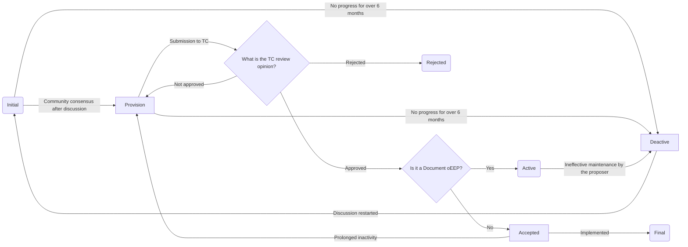

## Motivation/Problem

Over the past three years, openEuler has undergone significant evolution and growth, leading to numerous crucial technical decisions. However, the process for these decisions has been fragmented, scattered across various Technical Committee (TC) and SIG meetings. Communication about these decisions has largely relied on direct developer interaction, with publication sometimes occurring through channels like the openEuler WeChat account, video presentations, or worse, not at all.

Consequently, understanding openEuler's technology evolution necessitates deep involvement in the development process. This lack of transparency in technical decision-making hinders broader community participation and growth.

Mature communities like Python, OpenStack, and Debian utilize publicly accessible documentation to record and communicate their technology evolution. These documents provide a transparent and searchable record of decisions, fostering understanding of the technology evolution trajectory and attracting broader developer participation.

In light of this, openEuler should also adopt a robust documentation and procedure framework similar to these successful communities.

## Solution Description

### Target Audience

openEuler Evolution Proposals (oEEPs) target current and future openEuler developers, practitioners, and technical decision-makers. They are not intended to be marketing or promotional materials.

### Types

oEEPs are categorized into three types:

- **Standard**: These oEEPs propose modifications to openEuler's code, tools, or configurations to introduce new functionality or modify existing implementations. Such changes have a visible impact on developers, system administrators, and end-users and require community review and discussion.
- **Document**: These oEEPs provide information about the openEuler community, including resources like community indexes, guidelines, specifications, development processes, environment setups, or best practices.
- **Process**: These oEEPs aim to improve or adjust aspects of community governance, development processes, or infrastructure.

### oEEP Development Workflow

All oEEPs originate in the **Initial** status. However, the subsequent development workflow differs for **Standard**, **Document**, and **Process** oEEPs.

**Standard** oEEPs begin in the **Initial** status. The first step involves identifying the impacted developers and users and fostering consensus through various communication channels. Once a general agreement is reached, the oEEP transitions to the **Provision** status.
A **Provision** oEEP then undergoes formal review by the TC. During this stage, the TC may challenge the completeness of the impact analysis or the feasibility of the implementation plan. If the proposal passes the review and decision-making process by the TC, it progresses to the **Accepted** status.
Otherwise, it either remains in the **Provision** status for further revisions or moves to the **Rejected** status. Once an oEEP reaches the **Accepted** status, substantial content revisions are no longer permitted. Upon successful implementation, it transitions to the **Final** status.
If an **Accepted** oEEP experiences prolonged delays in implementation, the TC can revert it to the **Provision** status for re-evaluation. If an oEEP remains inactive in either the **Initial** or **Provision** status for over six months, the TC designates it as **Deactive**. Reactivating such an oEEP requires restarting the process from the **Initial** status. The proposer retains the right to withdraw an oEEP at any point. Upon withdrawal, the oEEP enters the **Withdrawn** status, is no longer subject to modifications, but is still archived.

**Process** oEEPs are a specialized form of **Standard** oEEPs, primarily affecting community infrastructure and the TC itself. Their development workflow mirrors that of **Standard** oEEPs.

**Document** oEEPs, after initialization, undergo a period of discussion and iteration between the author and relevant stakeholders, leading to the **Provision** status. A **Provision** **Document** oEEP, upon successful review and approval by the TC, transitions to the **Active** status.
The author is then granted the authority to maintain and revise the **Active** oEEP based on community progress. The author is responsible for ensuring the information within an **Active** oEEP remains current and accurate.
If the author is unable to effectively maintain the oEEP, the TC assumes responsibility and changes its status to **Deactive**. While the content of a **Deactive** oEEP might be outdated, it can still serve as a valuable historical reference.

Any oEEP can be superseded by a subsequent oEEP as the community evolves, transitioning the original oEEP to the **Substituted** status. The numbering of a **Substituted** oEEP remains unchanged.

The following figure shows the oEEP development workflow.

### oEEP Format Requirements

Submitted oEEP file names should adhere to the format of **oEEP-**_XXXX_, where _XXXX_ represents the next available four-digit identifier.
oEEPs must be written in Markdown format.

### oEEP Development Process

oEEPs are submitted as pull requests (PRs) to the **gitee.com/openeuler/TC/oEEP** repository.
oEEPs in the **Initial** and **Provision** statuses are open to substantial revisions. oEEPs in the **Accepted**, **Active**, and **Final** statuses can undergo periodic, minor revisions. oEEPs classified as **Withdrawn** or **Rejected** are not eligible for any revisions.

## References and Links

- OpenStack Blueprints: [https://wiki.openstack.org/wiki/Blueprints](https://wiki.openstack.org/wiki/Blueprints)
- Python PEPs: [https://peps.python.org/pep-0000/](https://peps.python.org/pep-0000/)
- Fedora Changes: [https://docs.fedoraproject.org/en-US/program_management/changes_policy/](https://docs.fedoraproject.org/en-US/program_management/changes_policy/)
- Fedora Change example: [https://fedoraproject.org/wiki/LTOByDefault](https://fedoraproject.org/wiki/LTOByDefault)
- OpenSUSE Proposals: [https://en.opensuse.org/openSUSE:Strategy_proposal_overview](https://en.opensuse.org/openSUSE:Strategy_proposal_overview)
- Debian Proposals: [https://dep-team.pages.debian.net/](https://dep-team.pages.debian.net/)
