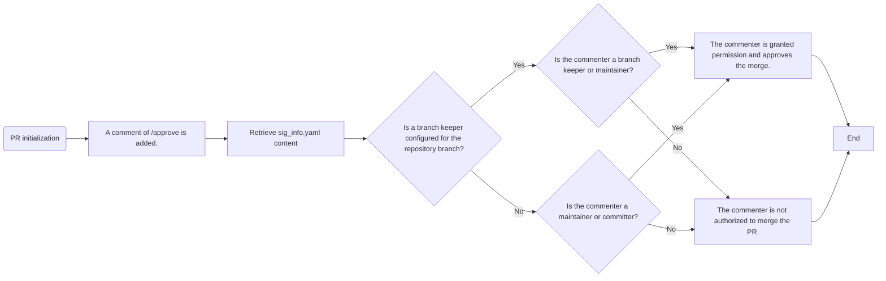

## Motivation/Problem

### Background

The openEuler community currently employs three roles within SIGs: maintainers, committers, and administrators.
Maintainers serve as the backbone of a SIG, overseeing its overall well-being and possessing the authority to review and merge code for all repositories within their SIG.
Committers, on the other hand, are responsible for the code quality of a specific repository, holding the power to approve and merge code within that repository.
Administrators, a specialized type of committer, have additional privileges beyond those of a regular committer, such as the ability to enable wikis, synchronize repositories, and build web pages.
However, the granularity of permissions of these roles is limited to the repository level, lacking the capacity for finer control at the branch level.

### Issues Resolved by this oEEP

Recently, several SIGs have reported inconsistencies between code merging requirements and branch management needs, primarily stemming from a large and dispersed committer base for certain repositories.
For instance, the kernel repository boasts over 70 committers, making it challenging to enforce consistent version management on community releases.
To address this, SIGs have expressed a desire for "branch keepers," individuals tasked with collaborating with committers and maintainers to ensure effective branch management.
This oEEP proposes an implementation strategy for such branch keepers.

## Solution Description

### 1. Introduction of Branch Keepers

After deliberation with various SIGs, we propose the introduction of a **branch keeper** role for repository branches. Key aspects of this role include:

1. Branch keepers will be nominated from existing repository committers.
2. Typically, only one branch keeper will be assigned per repository branch.
3. The specific repository and branch must be specified for a branch keeper.
4. Branch keeper configuration information will be stored in the **sig_info.yaml** file.
5. Whether to utilize branch keepers will be determined by individual repositories as required.
6. In the absence of a branch keeper, the existing permissions structure for all branches within a repository will remain unchanged, granting access to maintainers and all committers.
7. Upon the designation of a branch keeper, the merge permission for the corresponding branch will be restricted to the branch keeper and maintainers.

### 2. Changes in Approval Logic

Before the change (or if a repository does not utilize branch keepers), the pull request (PR) merge permissions for all branches within a repository were as follows.
| Role       | PR Merge Permission |
| ---------- | ------------------- |
| Maintainer | &#10004;            |
| Committer  | &#10004;            |

After the change, if a PR targets a branch with a configured branch keeper, the PR merge permissions will be as follows.

| Role          | PR Merge Permission |
| ------------- | ------------------- |
| Maintainer    | &#10004;            |
| Committer     | &#10005;            |
| Branch keeper | &#10004;            |

### 3. Configuration Method

The **sig-info.yaml** file, located within the community repository of the relevant SIG (<https://gitee.com/openeuler/community/tree/master/sig>), will be augmented with a **branches** configuration section.
Each entry within the newly added **branches** list will represent a branch keeper configuration.

```yaml
...
branches:
  - repo_branch:
      - repo: openeuler/kernel
        branch: openEuler-20.03-LTS-SP1
      - repo: openeuler/kernel-doc
        branch: openEuler-20.03-LTS-SP1
    keeper:
      - gitee_id: zhangsan1
     name: zhangsan
     organization: ABC
     email: zhangsan***@qq.com
  - repo_branch:
      - repo: src-openeuler/kernel
        branch: openEuler-22.03-LTS-SP2
    keeper:
      - gitee_id: lisi1
        name: lisi
        organization: AABB
        email: lisi****@163.com
...
```

Description of related fields:
| Field       | Type       | Description                                                                              |
| ----------- | ---------- | ---------------------------------------------------------------------------------------- |
| repo_branch | List       | A set of repositories and branches sharing the same branch keeper                        |
| keeper      | Dictionary | Branch keeper information, including **gitee_id**, **name**, **organization**, **email** |

### 4. Implementation Process



### Impact Assessment

This change is incremental.

1. SIGs that do not require branch keepers will remain unaffected.
2. For branches with configured branch keepers, the code merge permissions for PRs targeting these branches will be impacted.
3. If only a subset of repositories within a SIG utilize branch keepers, the change will not affect the remaining repositories or branches without configured branch keepers.
